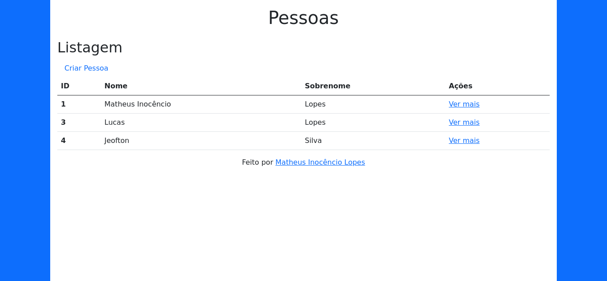

# Fábrica de Software - Workshop 2020.1 - Backend

Repositório do Workshop 2020.1 de Backend com Django para
[Fábrica de Software - UNIPÊ](https://gitlab.com/repositoriodafabrica)

[:scroll: Sobre](#scroll-sobre) | [:wrench: Ferramentas](#wrench-ferramentas)

## :scroll: Sobre

Foi desenvolvido uma aplicação web de gerenciamento de pessoas, de modo altamente produtivo e rápido, utilizando Python,
Django, SQLite e Bootstrap.

## :wrench: Ferramentas

- [Python 3.8.5](https://www.python.org/downloads/release/python-385/)
- [pyenv](https://github.com/pyenv/pyenv) *Opcional*
- [PyCharm](https://www.jetbrains.com/pt-br/pycharm/download/)
- [Django 3.1](https://docs.djangoproject.com/pt-br/3.1/)
